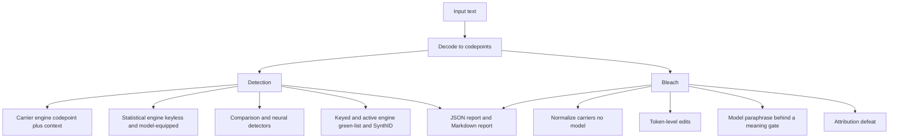

# BleachMark

BleachMark is a cybersecurity research tool for hidden signals in LLM text. It
detects watermarks and steganographic carriers in ASCII and Markdown text from
large language models. It bleaches those signals while it keeps the meaning.

To BleachMark, LLM watermarking is a steganography and covert-channel problem.
The mission is defensive: understand how a malicious model can embed hidden
control content or a user-attribution mark, then build detectors and defenses. A
hidden user-attribution mark can identify the author of a text. The tool bleaches
that mark and keeps the author hidden.

## What it detects and bleaches

- Post-hoc carriers: zero-width characters, the Unicode Tags block (ASCII
  smuggling), variation-selector runs, homoglyphs, whitespace, Markdown carriers,
  and bidirectional overrides.
- Statistical watermarks: green/red-list logit bias, SynthID-Text tournament
  sampling, and related schemes.
- User-attribution marks: multi-bit payloads that can identify a user.

## How it works



The default posture is keyless but model-equipped. The tool starts with no
watermark key, but it has the source model and comparison models. It uses
comparison across runs and models to find a possible watermark. The keyed modules
wait for keys.

The tool gives a false-positive rate for each score. The tool does not give a
yes-or-no "AI-written" verdict from a statistical score alone.

## Runtime

| Part | Dependency | Network |
| --- | --- | --- |
| Carrier detect and bleach | Core, no model | None |
| Statistical score | Core | None |
| Neural and model-based methods | Optional install group | Local model or opt-in API |
| Keyed z-test and SynthID | Optional install group, plus a key | None |

## Quick start (development)

```
pip install -e .
python -m pytest
bleachmark detect FILE            # exit code 2 on a high-confidence carrier
bleachmark detect FILE --json     # canonical JSON, payload redacted
bleachmark bleach FILE            # normalize carriers, print the clean text
```

## Status

- Version: v0.1 (MVP built).
- The v0.1 source tree is in `src/bleachmark/`. All 11 slices in `tasks/todo.md`
  have code with tests. The test suite has 67 tests and passes. `ruff` is clean.
- The core detect and carrier-bleach paths use no model and make no network call.
  The neural, keyed, and model-based paths use an optional model or key.
- The green-list z-test, the SynthID g-value test, and the multi-bit attribution
  scheme run on generated samples in the effectiveness harness.
- A provider adapter (`runtime/providers.py`) turns a provider model into a callable,
  so the comparison detector and the code probe run against a provider model.
- The constrained code probe (`detect/code.py`) canonicalizes each generation, so
  it measures structural token choice, not the code format.
- The evolution loop (`evolve/`) evolves prompt strategies and detectors against a
  known stego modality, and it estimates the partition (the key).
- The context-keyed signature (`detect/context_keyed.py`) separates a watermark
  from a style favorite. The doubles validate it.
- Honest result: three keyless probes on `claude-opus-5` (a post-2026-08-02 model
  that marks at launch) gave no confound-free watermark signal. That is the
  undetectability wall, and the tool reports the null (VIBE_HISTORY 2026-08-11).

## Companion docs

- `docs/VISION.md` — the strategic north star.
- `docs/REQUIREMENTS.md` — the structured requirements.
- `docs/SUCCESS_CRITERIA.md` — the measurable success criteria.
- `docs/ARCHITECTURE.md` — the design and why.
- `docs/2026-08-10_LLM_Text_Watermarking_Research.md` — the research analysis.

## License

The owner selects the license.
