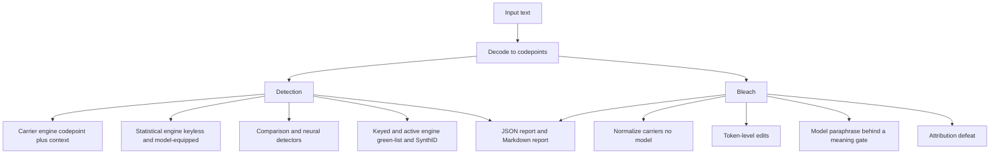

# BleachMark

BleachMark is a cybersecurity research tool for hidden signals in LLM text. It
detects watermarks and steganographic carriers in ASCII and Markdown text from
large language models. It bleaches those signals while it keeps the meaning.

To BleachMark, LLM watermarking is a steganography and covert-channel problem.
The mission is defensive: understand how a malicious model can embed hidden
control content or a user-attribution mark, then build detectors and defenses. A
hidden user-attribution mark can identify the author of a text. The tool bleaches
that mark and keeps the author hidden.

## What it detects and bleaches

- Post-hoc carriers: zero-width characters, the Unicode Tags block (ASCII
  smuggling), variation-selector runs, homoglyphs, whitespace, Markdown carriers,
  and bidirectional overrides.
- Statistical watermarks: green/red-list logit bias, SynthID-Text tournament
  sampling, and related schemes.
- User-attribution marks: multi-bit payloads that can identify a user.

## How it works



The default posture is keyless but model-equipped. The tool starts with no
watermark key, but it has the source model and comparison models. It uses
comparison across runs and models to find a possible watermark. The keyed modules
wait for keys.

The tool gives a false-positive rate for each score. The tool does not give a
yes-or-no "AI-written" verdict from a statistical score alone.

## Runtime

| Part | Dependency | Network |
| --- | --- | --- |
| Carrier detect and bleach | Core, no model | None |
| Statistical score | Core | None |
| Keyless corpus detection and calibrated rate | Core | A model request for the corpus |
| Neural and model-based methods | Optional install group | Local model or opt-in API |
| Keyed z-test and SynthID | Optional install group, plus a key | None |
| Local inference (llama.cpp) | Optional install group | Local model only |
| Local engine on the OpenAI API | Core (urllib) | Local engine only |

## Quick start (development)

```
pip install -e .
python -m pytest
bleachmark detect FILE            # exit code 2 on a high-confidence carrier
bleachmark detect FILE --json     # canonical JSON, payload redacted
bleachmark bleach FILE            # normalize carriers, print the clean text
bleachmark report FILE            # a Markdown report
```

Model-equipped commands (a key file or a local engine is necessary):

```
bleachmark hardware               # detect the GPU and video memory, check a local engine, recommend models
bleachmark calibrate-code   --candidate claude --references openai,gemini --task fib
bleachmark calibrate-prose  --candidate claude --references openai,gemini,local --samples 16
```

Point the local commands at a local engine that speaks the OpenAI API:

```
export BLEACHMARK_LOCAL_URL=http://tars.uberadmin.com:5150/v1
bleachmark calibrate-prose --candidate claude --references local --samples 16
```

## Status

- Version: v0.1 built, plus a 2026-08 research tranche on code and prose. The source
  tree is in `src/bleachmark/`. The test suite has 172 tests and passes.
- The core detect and carrier-bleach paths use no model and make no network call. The
  neural, keyed, and local-inference paths use an optional model or key.

### Detection

- The steal-and-test partition z-test (`detect/partition_test.py`) with a featurizer
  (`detect/features.py`) finds a keyed structural watermark and a slot-permutation null
  divides it from model style. The prose path (`detect/prose.py`) does the same by the
  green-list context, for a story or an editorial above 400 words.
- The calibrated style baseline (`detect/calibrate.py`) turns a gap into a false-positive
  rate against reference unwatermarked corpora, so the tool gives a rate, not a verdict.
- The context variants (`detect/keyed/windowed.py`) include the SelfHash scheme
  (Kirchenbauer, arXiv:2306.04634), a context-free scheme, and a window scheme.
- The green-list z-test, the SynthID g-value test, and the attribution scheme run on
  the harness samples.

### Bleach

- The bleach co-evolution (`evolve/coevolve.py`, `evolve/bleachevolve.py`) evolves a
  defense prompt and a detector against a known modality, with a hard meaning gate.
- The bleach-strategy evolution (`evolve/bleachstrategy.py`, `bleach/strategies.py`,
  `bleach/reorder.py`, `bleach/transcode.py`) examines the reorder and the transcode
  families. The watermark-context vs bleach game (`evolve/watermark_game.py`) finds the
  equilibrium.
- The live bleach (`bleach/live.py`) rewrites code and makes sure of the meaning with a
  compile-and-test gate.

### Local inference

- Hardware detection (`runtime/hardware.py`) reads the GPU, the video memory, the CUDA, the
  CPU, and the RAM. A model registry (`runtime/models.py`) selects the largest model that
  fits the video memory. The deploy path (`runtime/local_llama.py`) downloads a GGUF and
  runs it with llama.cpp behind the optional group.
- The local endpoint is configurable (`BLEACHMARK_LOCAL_URL`), so the tool connects to a
  local engine that speaks the OpenAI API. `bleachmark hardware` reports the host and the
  engine.

### The honest result

- Keyless detection hits the undetectability wall, shown on a configured model at scale.
  On `claude-opus-5` (a post-2026-08-02 model that marks at launch) the calibrated
  false-positive rate stays near 0.5 for code and for prose, up to 11000 words and against a
  same-family pre-cutoff control. The tool reports no watermark, because a distortion-free
  scheme has no keyless signal. The Christ-Gunn-Zamir limit holds.
- The bleach game has a pure equilibrium: a context-free watermark is a dominant defense, and
  a token substitution removes more than the reorder family at equal fidelity.

## Companion docs

- `docs/VISION.md` — the strategic north star.
- `docs/REQUIREMENTS.md` — the structured requirements.
- `docs/SUCCESS_CRITERIA.md` — the measurable success criteria.
- `docs/ARCHITECTURE.md` — the design and why.
- `docs/2026-08-10_LLM_Text_Watermarking_Research.md` — the research analysis.

## License

The owner selects the license.
