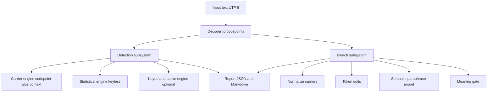
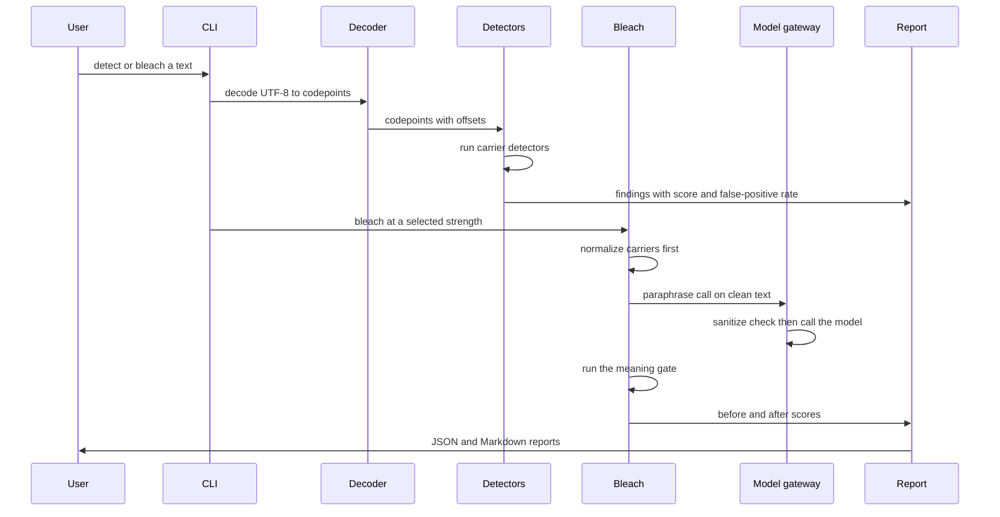
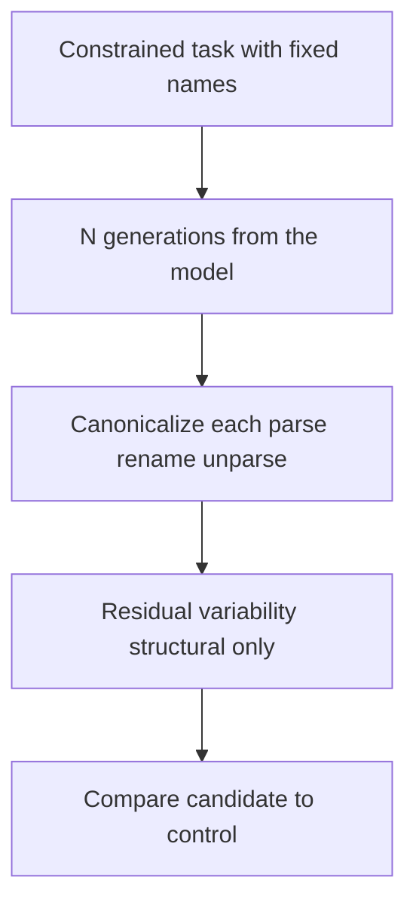
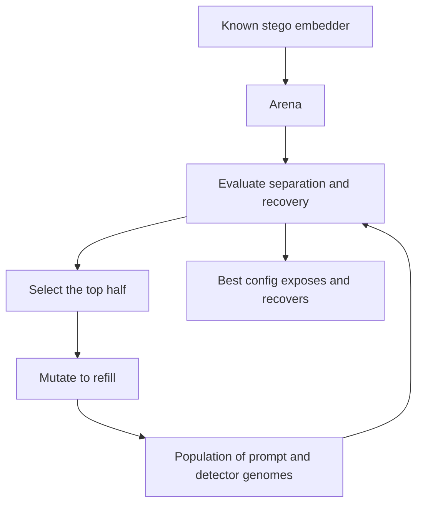

# BleachMark — Architecture

**Author:** Ron Dilley
**Date:** 2026-08-10
**Status:** v0.1 built, updated 2026-08-13.
**Companion docs:** `VISION.md`, `REQUIREMENTS.md`, `SUCCESS_CRITERIA.md`,
`2026-08-10_LLM_Text_Watermarking_Research.md`

This document tells why the tool makes each decision. The diagrams support
the prose. The prose is the record.

---

## 1. The shape of the system

BleachMark is not a generic text cleaner. Two facts from the research shape the complete system.

First, detection and removal are not equal in strength. A keyless tool cannot find
a good statistical watermark, because a good watermark is pseudorandom without the
key (research §5, Christ and others). But a keyless tool can remove or weaken many
watermarks, because a meaning-preserving transformation degrades the signal
without a need to find it (research §4). So the system keeps detection and bleaching as two subsystems with different strength claims.

Second, the two signal classes use two different engines. A post-hoc carrier is a
codepoint fact, found by an accurate scan with a context test. A statistical
watermark is a distribution fact, found only by a statistical test, and frequently not
at all. So the detection subsystem holds a carrier engine and a statistical
engine, and it does not mix their confidence claims.



## 2. Decision: detection and bleaching are two subsystems

Decision: build detection and bleaching as two subsystems with one shared data
model, and not one combined pass.

Alternative: one pass that finds a signal and then removes it.

Why this is correct. The strength claims are different. Detection of a statistical
watermark is weak or not possible without a key, but bleaching does not use
detection first (research §4 and §5). A combined pass would connect the strong function to the weak one, and the tool would under-bleach when detection
did not work. Separation lets the bleach run blind at a chosen strength.

How it could be incorrect. A user may want "find and fix" in one step. Mitigation: the
CLI can chain detect and bleach, but the subsystems stay apart in the code.

## 3. Decision: a keyless default path and a gated keyed path

Decision: the default path is keyless. The keyed and active modes are optional
modules behind a gate.

Alternative: one detection path that assumes key access.

Why this is correct. The realistic defender sees only output text and holds no key
(research §5). The keyless path must work with no model and no secret. The keyed
green-list z-test and the SynthID-Text detector use more inputs (a key, a
tokenizer, a configuration), and the active black-box test needs model queries.
These are strong when the tool has them, but rare, so they must not stop the usual path.

Keyless does not mean model-free. The tool is model-equipped. It uses the source
model and comparison models for the comparison method (§9). The no-model carrier
path is the baseline for a user without a model.

How it could be incorrect. A user may think the keyless mode is as strong as the keyed
mode. Mitigation: each result carries a posture label and a stated false-positive
rate (FR-14, FR-22).

## 4. Decision: one detector interface with a calibrated score

Decision: each detector gives a result through one interface. The result holds a
score, a stated false-positive rate, a posture label, a list of locations, and a
length-aware confidence (FR-49).

Alternative: each detector gives its own shape.

Why this is correct. The base-rate problem makes an uncalibrated number a danger
(research §5). A single interface forces each detector to tell its false-positive
rate, so the report does not show a bare verdict. A single interface also lets a new
detector connect with no change to the report code (AR-03, AR-04).

How it could be incorrect. Some detectors give a p-value, some give a probability, some
give a z-score. Mitigation: the interface holds the raw statistic and a mapped
score, so the report can show the two.

## 5. Decision: carrier detection is a codepoint scan plus a context test

Decision: the carrier engine finds a candidate by codepoint, then it exonerates a
legitimate use by script, base character, and position before it flags.

Alternative: a codepoint blacklist alone.

Why this is correct. Each carrier codepoint has a legitimate use (research §7.7). A
blacklist alone flags each emoji joiner, each RTL mark, and each BOM at the file start,
and the user turns the tool off. The context test keeps the high-signal results
(tag characters in prose, detached selector runs, mixed-script single tokens) and clears the legitimate results.

How it could be incorrect. The context rules are complex and can miss a legitimate use.
Mitigation: keep the codepoint sets and the context rules in data files. Give each carrier a positive fixture and a legitimate-use fixture (MR-02, TR-02).

## 6. Decision: bleaching is a strength ladder with a meaning gate

Decision: the bleach subsystem offers three strengths. Each strength runs behind a
meaning-preservation gate.

Alternative: one fixed bleach method.

Why this is correct. The research gives a clear sequence of effect for each meaning cost
(research §4 and §8).

The lowest strength normalizes a post-hoc carrier with no
model and no meaning cost. The middle strength makes token-level edits. The highest
strength makes a semantic paraphrase with a model, which is the cleanest strip but
uses a model and costs some meaning. A ladder lets the user select the trade-off.
The gate rejects each result that does not keep the meaning (FR-27, FR-28).

For non-English text the gate uses a language-matched metric and threshold
(FR-27a). Chinese and Japanese use character n-grams. Arabic has its own floor.

How it could be incorrect. The paraphrase strength uses a model, which is a heavy
dependency. Mitigation: the model sits behind an optional install group, and the
two lower strengths work with no model (NFR-03).

Security sequence. The tool runs the deterministic carrier bleach before a model
request. A smuggled payload does not get to the paraphrase model (SR-06). This
sequence is a hard rule, not an option. The model gateway holds this rule (§9).

<!-- AI review 20260810-234903: gemini, claude -->

The gate is the load-bearing node. The meaning gate is the single node of the
bleach thesis. If the gate is too strict, the tool rejects a good bleach. If the
gate is too loose, the tool removes meaning with no warning.

The default metric is a sentence-embedding cosine similarity in the P-SP family.
The English human band is near 0.76 (research §4). For non-English text the gate
uses a language-matched metric (FR-27a). The gate calibration is a prerequisite
for the bleach slices, not an open question.

<!-- AI review 20260811-003657: gemini, claude -->

## 7. Decision: no per-document keyless watermark score

Decision: the tool does not score a single document for a watermark on the keyless
path, and it does not score a text as machine-generated. The keyless signal comes
from cross-run and cross-model comparison (§9) and, at scale, a corpus-level
green-list estimator.

Alternative: claim keyless detection of a specified watermark in one document.

Why this is correct. No published method does passive single-document keyless
detection of a distortion-free or undetectable watermark, and theory says there may
be none (research §5). The tool input is model output by definition, so a
machine-generation score is not a question the tool must answer.

How it could be incorrect. A cross-model comparison can confuse model style with a
watermark (research §5). Mitigation: the tool tells the limit and gives a calibrated
false-positive rate for each result (AR-03, FR-38a).

## 8. Decision: keyed modules sit behind optional extras

Decision: the green-list z-test, the SynthID-Text detector, and the active
black-box test live in optional modules with their own install groups.

Alternative: build these into the core.

Why this is correct. Each module uses a heavy or special input: a tokenizer, a
SynthID configuration, or a model query function (IR-02, IR-03, IR-04). The core
must stay light and offline (NFR-02, NFR-03). The SynthID-Text support is a stated
requirement (FR-19), so the module ships in v0.1, but its dependency is optional.

How it could be incorrect. A user may want SynthID detection with no configuration.
Mitigation: the module gives a clear message when the user gives no configuration.

## 9. Decision: model-equipped detection and the harness

Decision: the tool has access to the source model and comparison models. It uses
comparison for detection and a model-based bleach. It estimates a user-attribution
payload. It measures its own effectiveness.

Alternative: a passive tool with heuristics alone and no model access.

Why this is correct. The realistic tool is model-equipped, not passive
(goal.md reframe). With model access the tool runs a black-box watermark-presence test and a
cross-run comparison, which are the strongest keyless methods (research §5). A
model-based bleach adds strength that a deterministic bleach does not give. A
watermark can attribute a text to a user, so the tool must estimate and defeat that
payload (research §6).

The tool measures what works with an effectiveness harness. The harness makes
watermarked samples, attacks them, and reports the detection rate and the bleach
rate for each stego method. This is a research project, so measurement is a core
function.

How it could be incorrect. Model access is heavy, and a comparison method can give
an incorrect signal. Mitigation: the tool uses NPU or GPU acceleration when the host
has it (FR-43). The tool gives a false-positive rate for each comparison result. The
carrier detectors run with no model, so a user without a model keeps a baseline.

The honest limit. A perfectly undetectable watermark stays undetectable. Model queries do not
change that (research §5, Christ and others). Comparison works against a deployed and
leaky scheme, not against the ideal scheme. The tool tells this limit.

The model gateway. Every model-bound path goes through one gateway in
`runtime/model.py` (SR-09). The gateway runs the carrier normalization first and
stops the call on an error. This puts the SR-06 sequence at one
choke-point, not at five call sites. The harness is the one audited special case. It sends a raw sample
only in a sandbox, not to an API (SR-10).

Investigative, not guaranteed. The comparison and the attribution estimate are
investigative methods. The harness measures each one. The success is a measured rate,
not a guaranteed detection. The attribution bleach runs blind, so it does not use the
estimate (FR-40).

Source code is a strong comparison target. Code has a defined syntax and a small
space of legitimate variation. The `detect/code.py` module tells a model to write
a well-known function many times, then it measures the variability (FR-45, FR-46).
A watermark bias stands out against the low-entropy background of canonical code.

The probe constrains the generation. The module fixes or limits the variable and
function names and the structure (FR-46a). This shrinks the innocuous variation
space. A watermarking model must then encode its bits in the small space that is
left, so the change becomes more obvious. The tool does not force the full
output, because a forced token carries no watermark (research §3).

The control model gives the null. A control model tells that it adds no
watermark, or it is a local model (FR-47). The differential variability between
the control and a watermarked model is the signal, and it answers the comparison
null question (§18). The tool holds the control claim as unverified and re-checks
it (FR-48).

<!-- reframe 20260811: Ron. AI review 20260811-003657 -->

<!-- AI review 20260811-003657: gemini, xai, claude, openai -->

## 10. Decision: JSON is canonical, Markdown is the human report

Decision: the JSON report is the canonical output. The Markdown report is a view
for a human reader.

Alternative: one human-only report.

Why this is correct. A pipeline consumes JSON. A human reads Markdown. A versioned
JSON schema lets a downstream tool parse the result with time (DR-02). This matches
the report pattern of the sibling tools.

How it could be incorrect. The two reports can drift. Mitigation: the Markdown report
renders from the JSON model, not from a different path.

## 11. Cross-cutting points

**Observability.** Each detection step logs at a selectable level (OR-01). Each
score records its method and its parameters, so a second run gives the same score
(OR-02, TC-16). The default log level does not record a decoded payload (OR-03).

**Error handling.** A missing optional dependency gives a clear message, not a long error output. A bleach that does not keep the meaning gives the input text and a message (TC-10). A detector failure does not stop the other detectors.

**Security.** The tool uses input as untrusted data (SR-01). The tool does not
run or transmit a decoded payload (SR-02). The tool reads a model API key only from
an environment variable or a key file (SR-04). The tool labels a covert-channel
result as a possible prompt-injection vector (SR-05).

The tool runs the carrier bleach before a model request (SR-06). The tool redacts a
decoded payload in a report by default, and it shows the payload length and a hash,
not the cleartext (SR-07). A cleartext payload is available only behind an explicit
flag with a warning (SR-08).

<!-- AI review 20260810-234903: gemini, claude -->

**Report layer.** The report layer holds two homes for a MUST. A redaction filter
in `report/` removes a key or a secret from each
output stream (SR-03). The report does not claim to detect a vendor production
watermark without the vendor key (FR-19a).

<!-- AI review 20260811-003657: claude, openai -->

**Exit code.** The `cli.py` sets a non-zero exit code from a high-confidence
carrier result only. A calibrated statistical rate does not set the exit code
(FR-36).

<!-- AI review 20260811-003657: gemini, claude, openai -->

**Cost.** The core path makes no network request and no model request (NFR-02). Only the
paraphrase bleach and the active test spend a model request, and the two are optional.

## 12. Module layout

```
src/bleachmark/
  __init__.py          package API surface
  cli.py               detect, bleach, report, calibrate-code, calibrate-prose, hardware, benchmark
  model.py             shared data model: Finding, Score, Report
  decode.py            UTF-8 to codepoint decode with offsets
  detect/
    __init__.py        detector interface and registry
    carriers/          the seven carrier detectors and the context exoneration
    comparison.py      cross-run and cross-model inference
    code.py            constrained code probe, AST canonicalization, structural_normalize
    code_c.py          lexical canonicalizer for C
    features.py        code to a (slot, variant) matrix, by reference alignment
    partition_test.py  steal-and-test partition z-test, slot-permutation null
    calibrate.py       calibrated style baseline, a gap to a false-positive rate
    prose.py           keyless prose detection by the green-list context, and calibrate
    context_keyed.py   context-keyed signature, watermark against style
    attribution.py     multi-bit user-attribution estimate
    length.py          length-aware detection confidence (attribution length)
    corpus.py          corpus-level unigram green-bias estimator (FR-17)
    keyed/
      greenlist.py     green-list z-test (Kirchenbauer, arXiv:2301.10226)
      windowed.py      context variants: unigram, window, SelfHash (arXiv:2306.04634)
      synthid.py       SynthID-Text detector (tool scheme)
      synthid_official.py official Transformers processor cross-check
      active.py        black-box watermark-presence test
  bleach/
    __init__.py        bleach interface and strength ladder
    normalize.py       carrier removal, lowest strength
    tokens.py          token-level edits, middle strength
    neural.py          model-based bleach
    attribution.py     defeat a user-attribution mark
    gate.py            meaning-preservation gate (token or embedding similarity)
    meaning_calibrate.py the gate threshold from labeled paraphrase pairs
    language.py        script + function-word language detect (FR-27a)
    live.py            live bleach, compile-and-test meaning gate, calibration runs
    reorder.py         the reverse-order bleach for prose
    strategies.py      the bleach-strategy library (reorder and transcode families)
    transcode.py       the deterministic transcode translator (reversed-word)
    translate.py       round-trip translation bleach, dictionary pivot (FR-29)
  report/
    json_emit.py       canonical JSON report
    markdown_emit.py   Markdown report from the JSON model
    calibration_emit.py the calibrated finding as Markdown or JSON
  data/
    codepoints/        codepoint set data files
    meaning/           language-matched gate thresholds and labeled pairs
    translate/         EN-ES pivot lexicon for the round-trip bleach
  runtime/
    model.py           the one model gateway, sanitize before every call
    accel.py           accelerator kind: cuda, npu, metal, cpu
    hardware.py        detect the GPU, video memory, CUDA, CPU, RAM
    models.py          model registry and video-memory-aware selection
    local_llama.py     download a GGUF and run it with llama.cpp (optional group)
    providers.py       provider adapters and the configurable local endpoint
  harness/
    generators.py      reference watermark generators and test keys
    measure.py         attack the samples and measure the rates
    throughput.py      carrier-scan throughput benchmark (>= 1 MB/s, NFR-01)
    schemes.py         scheme benchmark: detectability drop and meaning cost (BC-04)
  evolve/
    arena.py           known stego embedder and the estimating detector
    evolution.py       the prompt and detector genomes and the loop
    realbridge.py      evolve a constraint prompt against a provider model
    coevolve.py        joint defense/detection co-evolution, meaning-floor gate
    bleachevolve.py    the bleach co-evolution, watermark removal with a meaning gate
    bleachstrategy.py  the bleach-strategy evolution, degradation against fidelity
    watermark_game.py  watermark-context vs bleach, minimax and fictitious play
    tranche.py         the code tranche driver, synthetic rounds and a model run
tests/
  fixtures/            watermarked, clean, and legitimate-use corpora
benchmark/             larger scheme benchmark (SCALE)
```

The `detect/code.py` module holds the constrained probe with the AST
canonicalization (Section 16). The `bleach/neural.py` module takes a model callable
through the gateway.

## 13. Data flow



## 14. Failure modes

- A legitimate-use carrier gives an incorrect flag. Surface: the legitimate-use
  fixture test. Recovery: the context rule in `detect/carriers/context.py`.
- The tool does not have the paraphrase model. Surface: a clear message at bleach time.
  Recovery: the two lower bleach strengths run.
- A bleach removes the signal but changes the meaning. Surface: the meaning gate.
  Recovery: reject the result and give the input text (FR-28).
- A keyed module gets no key or configuration. Surface: a clear message. Recovery:
  the keyless path runs.
- A smuggled payload rides in the input to the paraphrase model. Surface: the
  carrier scan. Recovery: the carrier bleach removes the payload before the model
  request (SR-06).

## 15. Version boundary

**v0.1 (MVP).** The owner keeps the full scope in v0.1 (goal.md reframe). v0.1
covers these parts:

- All carrier detectors with context exoneration.
- The comparison detector with a stated false-positive rate.
- The black-box watermark-presence test and the attribution estimate.
- The three bleach strengths with the meaning gate.
- The model-based bleach and the attribution bleach.
- The green-list z-test and the SynthID-Text module for the time when keys arrive.
- The effectiveness harness and the NPU or GPU acceleration.
- The JSON and Markdown reports, the CLI, and the library.

**v0.2 (SCALE).** The larger scheme benchmark (BC-04) is built
(`harness/schemes.py`, default 24 samples by 400 tokens). The corpus-level
unigram estimator (FR-17) is built (`detect/corpus.py`). The round-trip
translation bleach (FR-29) is built (`bleach/translate.py`). The
language-matched meaning gate (FR-27a) is built (`bleach/language.py`).
These SCALE items have code and measured data.

**v0.3 (VNEXT).** A local service surface for pipeline integration. A tracker for
new watermark schemes.

## 16. Decision: the constrained code probe minimizes the stego surface

Decision: the code probe constrains the generation, then canonicalizes each output,
then measures the residual variability.

Alternative: measure the raw variability of unconstrained code.

Why this is correct. Code has a small space of legitimate variation. The probe
sets the names and the structure in the prompt. Then it parses each output to a
syntax tree, renames each identifier, and unparses (FR-53). This removes the name,
the whitespace, the comment, and the literal-format channels. This leaves only
structural token choice, and a watermark must work there (FR-54).

Each generation must be more than 400 words (FR-55, FR-49). A short function is
not useful. The probe asks for a complete module.

How it could be incorrect. A fully canonical task gives the model no room. The watermark and the detector
then have no signal. Mitigation: the evolution
loop looks for the structural freedom that exposes the signal (Section 17).



## 17. Decision: adversarial training and evolution

Decision: the tool evolves prompt strategies and detectors against a known stego
embedder, and it measures the fitness across the generations.

Alternative: a fixed prompt and a fixed detector.

Why this is correct. The best prompt and the best detector are not known before the
run. The loop fixes a known stego modality, such as the green-list scheme (FR-57).
It evolves a prompt genome and a detector genome (FR-56). The detector estimates
the stego partition from samples, which is key recovery for this modality (FR-58).

The fitness rewards detection separation and partition recovery, and it penalizes a
false-positive result (FR-59). The fitness goes up across the generations (FR-60).

How it could be incorrect. The loop learns against the reference embedder, not a
provider model. Mitigation: the evolved prompt is a constraint template that
moves to a provider model, and the tool tells the limit of that move.



The empirical limit on a provider model. The evolution and the signature work in
the reference domain, where the tool plants the key. On a live provider model the
tool ran three keyless probes: a structural residual, a synonym context-flip, and
an arbitrary-token context-flip. Each one confounded or gave no signal (VIBE_HISTORY
2026-08-11).

The candidate for the tests was `claude-opus-5`, a model launched on or after
2026-08-02, so it marks at launch (research §6). No keyless probe gave a
confound-free watermark signal. This is the undetectability wall in practice, and
the tool reports an honest null, not an incorrect flag (FR-62).

<!-- build 20260811: Ron -->

## 18. Open questions

Which paraphrase model gives the cleanest bleach for each meaning cost on a local
runtime? A benchmark must give the answer.

What is the correct meaning-gate threshold for a high-stakes text? The research
gives a band, not a single number (research §4).

Can the corpus-level green-list estimator give a useful signal on a document set
without a key? Answered 2026-08-13. A unigram (leaky) mark on local Mistral-7B
gave z 5.16 against a same-source control at z 0.34.

A distortion-free scheme has no keyless leak. See
`docs/results/2026-08-12_corpus_estimator_real.json`.

Can the mixed-script test hold 1 MB each second in pure Python, or must it have a
compiled part? Answered 2026-08-12. Typical 8.5 MB/s, worst-case 1.9 MB/s.

The two rates are above 1 MB/s (NFR-01). No compiled part.
<!-- AI review 20260810-234903: gemini, xai -->

How does the NPU or GPU acceleration stay the same on Windows and on POSIX
(NFR-04, FR-43)? Partial. `runtime/accel.py` gives a label.

Local llama.cpp uses the GPU when the host has one. Defer a full dispatcher.
<!-- AI review 20260811-003657: gemini, openai -->

What is the null hypothesis for the comparison detector, so it does not confuse
sampler variance or model style with a watermark? Answered 2026-08-11.

The null is a same-size style baseline from reference corpora, reported as an
FPR (`detect/calibrate.py`). A same-model control beats a different-model control.
  <!-- AI review 20260811-003657: claude, gemini, openai -->
